# 🎓 Virtual Teaching Assistant (VTA)  
_Transforming Classrooms with AI-Powered Insights, Automation & Support_

---

## 🧭 Introduction

Welcome to **Virtual Teaching Assistant (VTA)** — a smart, end-to-end AI-driven educational companion designed to **listen, understand, assist, and enhance** the learning process for students, teachers, and educational institutions. With powerful NLP models, real-time audio transcription, intelligent dashboards, and chat-based learning, this assistant bridges the gap between **teaching** and **comprehension** — one class at a time.

> Imagine a system that never misses a word, always takes perfect notes, builds quizzes, answers questions like a tutor, and provides rich performance analytics — all in real-time. That’s VTA.

---

## ❓ The Problem

Despite advances in EdTech, several key issues remain:

### 👨‍🎓 For Students
- Missing lectures or zoning out for a few minutes can lead to knowledge gaps.
- Revision during exams becomes chaotic due to unorganized notes.
- Struggling to catch up on missed or misunderstood concepts.
- Lack of personalized feedback or help outside class hours.

### 👩‍🏫 For Teachers
- Difficult to track how well students are absorbing the content.
- Inability to dynamically adapt based on student comprehension.
- Manual quiz creation and analysis is time-consuming.

### 🏛️ For Universities
- No central view of class engagement or instructional effectiveness.
- Hard to measure which professors and courses are truly resonating with students.
- Missed opportunity to optimize academic delivery through data.

---

## 🧪 The Solution: Virtual Teaching Assistant

VTA offers an integrated solution to these problems through the power of **LLMs**, **automated transcription**, **smart dashboards**, and **conversation-based learning**.

### 🧠 Core Idea
> VTA “listens” to the lecture, understands the content, summarizes it, generates quizzes, answers doubts, and surfaces analytics — empowering all stakeholders.

---

## 💡 Key Features Breakdown

### 🔊 Audio Understanding Pipeline
- Uses **audio preprocessing** (noise reduction, normalization, filtering) to clean live lecture input.
- **OpenAI Whisper API** converts the cleaned audio into accurate **textual transcripts**.
- Text is segmented, labeled by topic, and sent to an **LLM (LLaMA3-8B)** via **Groq API** for intelligent understanding.

### ✍️ Summarization & Notes
- Generates **clean, structured summaries** for every session.
- Students can refer back to summaries during exams or revisions.
- Highlights **key topics, definitions, and important subtopics**.

### ❓ Quiz Generation
- AI curates **topic-specific quizzes** automatically after each lecture.
- Supports **multiple-choice**, **true/false**, and **short-answer** formats.
- Students can attempt quizzes to reinforce retention, and results feed into performance analytics.

### 🤖 Chatbot Learning Support
- A built-in AI chatbot helps students explore or re-learn misunderstood concepts.
- Summaries and transcripts are used as context so students can ask:
  - “Explain Ohm’s Law again.”
  - “What did the teacher say about photosynthesis?”
  - “Quiz me on today’s lecture.”

### 📈 Dashboards & Analytics

#### For Students:
- Track quiz attempts, scores, and comprehension levels.
- See topic-wise performance trends over time.
- Get **personalized insights**: what to revise, what’s still unclear.

#### For Teachers:
- Identify **topic-level drop-offs** where students struggle.
- Compare **individual vs class** performance.
- See who’s lagging and intervene meaningfully.

#### For Universities:
- Monitor **faculty impact** across departments.
- Know which classes are seeing engagement and improvement.
- Use institutional data to make **academic policy decisions**.

---

## 🏗️ Project Architecture

📦 project-root/

├── server-python/ # LLM + Audio Processing + Quiz & Summary Engine

├── server-postgres/ # Database & API server

├── client/ # Frontend

---

## 🌐 Real-World Workflow Example

### Let’s walk through a real classroom session:

1. **Lecture Begins**  VTA starts recording and preprocessing audio live.

2. **Post Lecture**  The transcript is generated → summary + quiz are created via LLM → results are stored in the database.

3. **Student Logs In**  Sees summary + takes quiz + reviews past scores.

4. **Student Has a Doubt**  Opens chatbot and asks a question related to a missed topic.

5. **Teacher Logs In**  Views class quiz results → identifies weak topics → adjusts next lecture plan.

6. **University Logs In**  Sees which professors’ classes are leading to better comprehension & grades.

---

## 🖼️ Visuals & Screenshots

Take a look at how **Virtual Teaching Assistant** looks and feels in action. These visuals showcase key features and UI elements across different user roles including students, teachers, and admins.

---

### 🏠 Landing Page  
_Start your journey with a seamless and intuitive welcome screen._

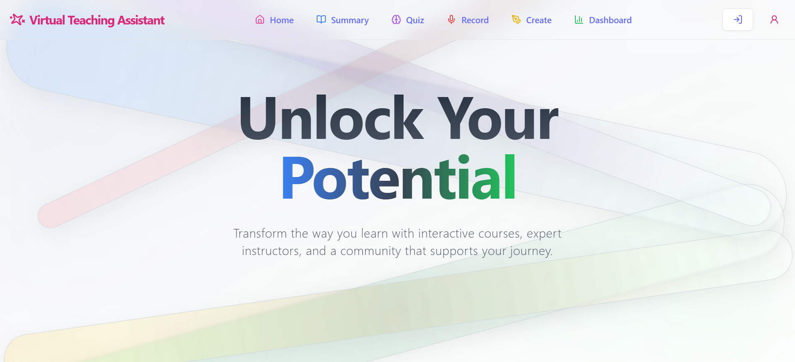

---

### 🎓 Student Dashboard Overview  
_View your progress, access summaries, quizzes, and insights — all in one place._

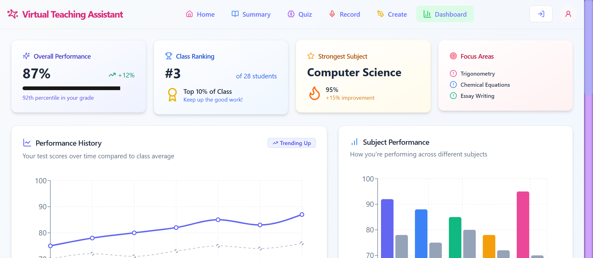

---

### 🎙️ Audio Capture Interface  
_Capture lectures in real-time with automatic preprocessing and noise handling._

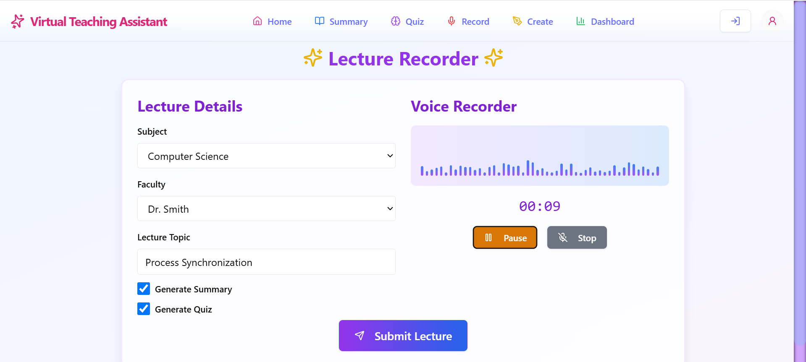

---

### 🧾 Lecture Summary View  
_AI-generated, structured summaries for efficient post-class revision._

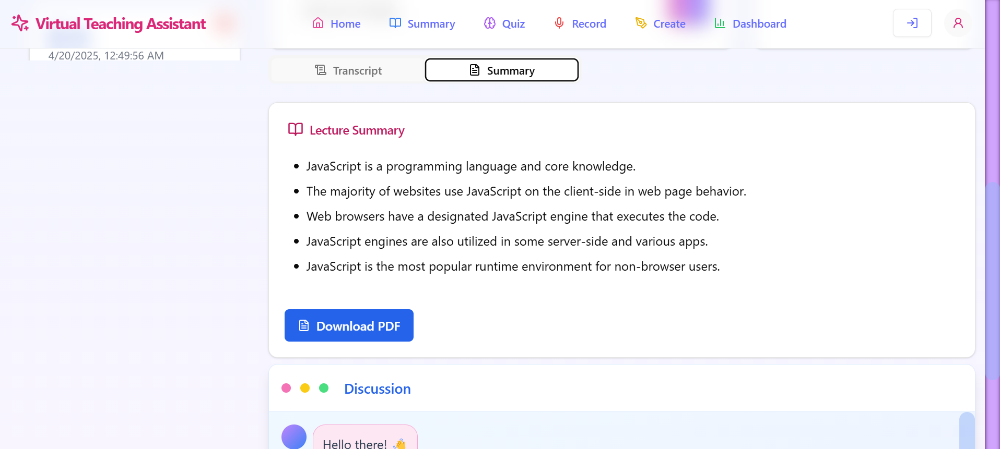

---

### 🤖 AI Chatbot for Concept Help  
_Ask topic-specific questions and get intelligent, contextual explanations._

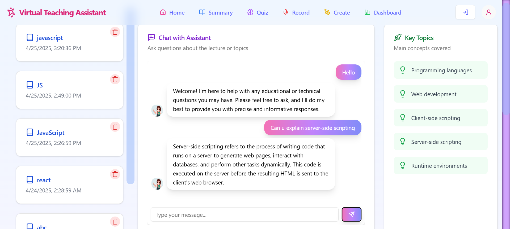

---

### 💬 Discussion Tab  
_Engage in collaborative learning — ask questions, get help, and share insights._

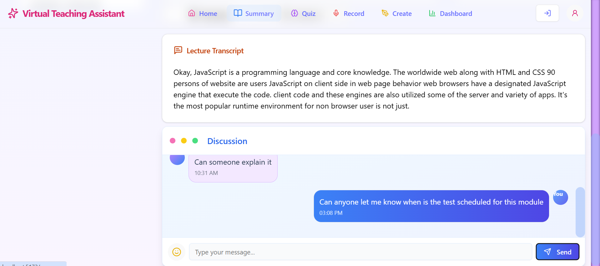

---

### 🧪 Create + Generate Quiz Interface  
_Generate quizzes from lecture content in real-time using LLMs._

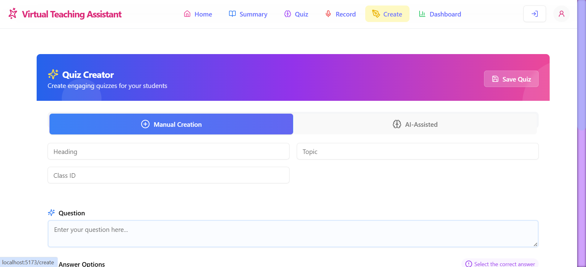  
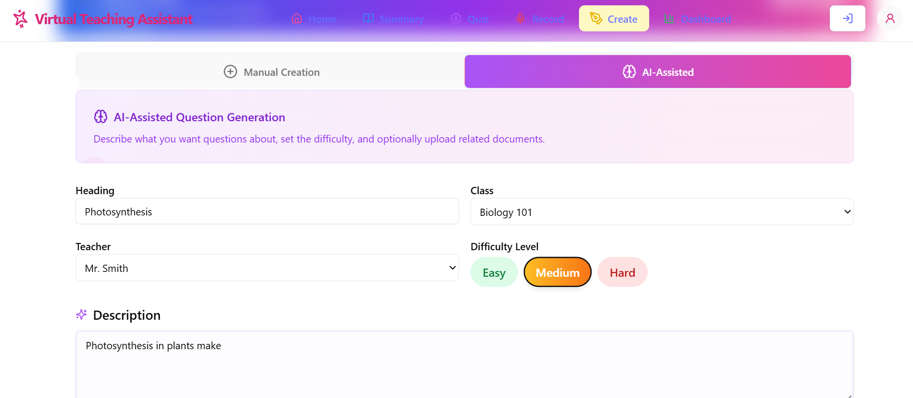  
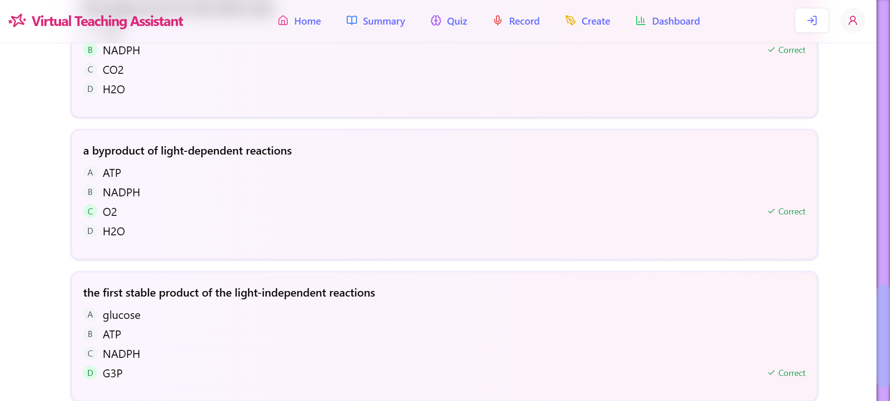

---

### 📝 Quiz Attempt Interface  
_Take quizzes designed to reinforce your understanding and prepare for exams._

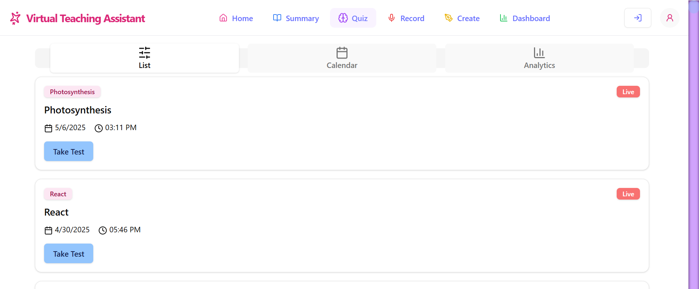  
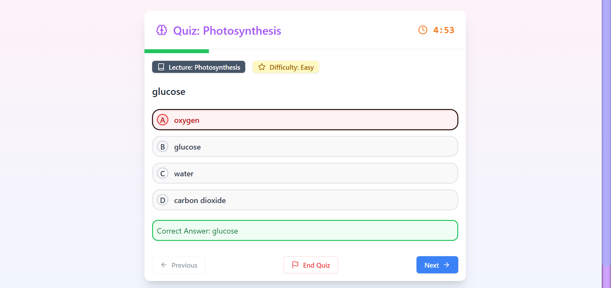

---

### 📊 Individual Quiz Results & Feedback  
_Instant feedback with visual insights to help students improve effectively._

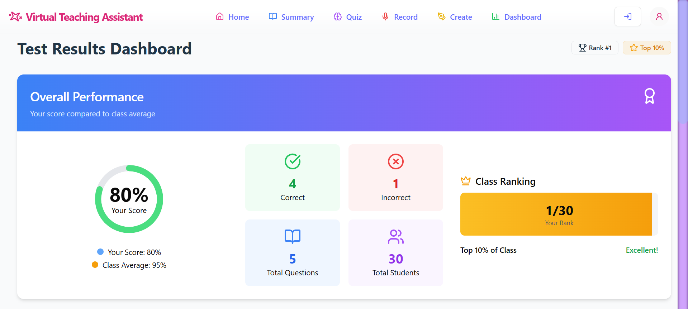  
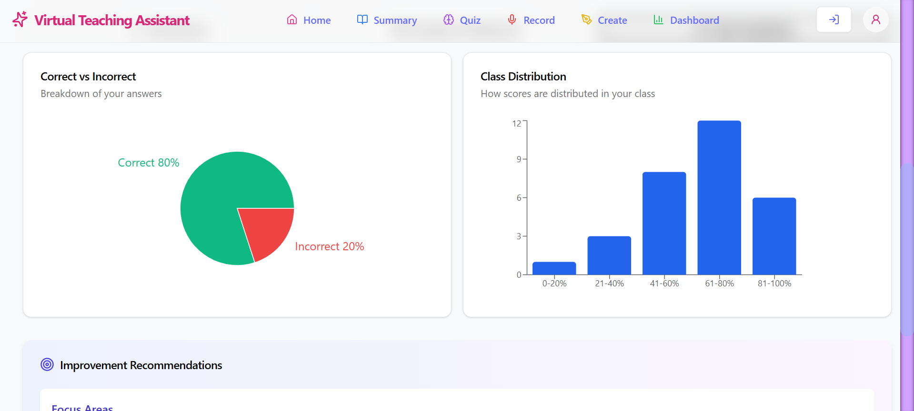

---

### 👩‍🏫 Teacher Dashboard – Class Performance  
_Visualize class-wide trends, identify struggling areas, and adapt lessons._

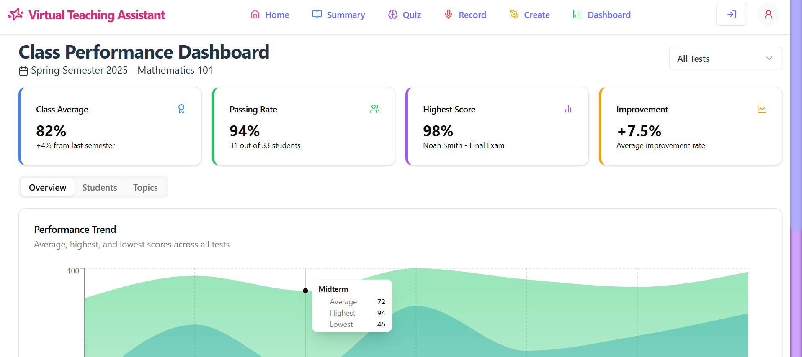  
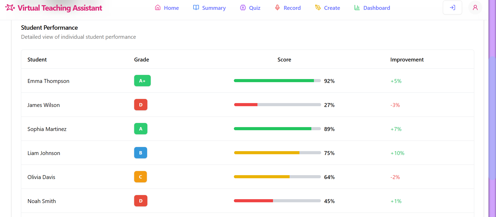

---

## ❤️ Acknowledgements

- [Groq](https://groq.com) for blazing-fast LLM inference
- [OpenAI Whisper](https://github.com/openai/whisper) for transcription
- React + Vite for the fluid frontend
- PostgreSQL + ExpressJS for scalable backend architecture

---

## 📬 Contact

Built with passion by **Adrija Dastidar**  
📧 Email: `adrijadastidar@gmail.com`  

---

> _"The best teaching assistant is the one that never sleeps, never forgets, and always listens."_  
> – Virtual Teaching Assistant

